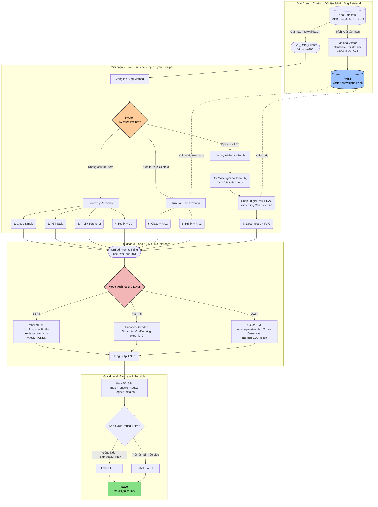

# 🔄 SML Flow: Sơ đồ Luồng Kiến trúc Thực Nghiệm Prompt Benchmark

Tài liệu này cung cấp bản vẽ trực quan toàn bộ vòng đời (Lifecycle) của 1 hệ thống Benchmark nội bộ được sử dụng trong dự án `SML_master_R5`. Lệnh thực thi sẽ đi từ việc xào nấu Dữ liệu (KB & Eval), qua luồng Bộ định tuyến Prompt (Prompt Router) chia làm 7 ngã, đi vào các hàm dự đoán phân ngành Model, và cuối cùng đối soát sinh ra điểm (Accuracy) ghi vào `.csv`.

## 🎨 Sơ đồ Hoạt động Toàn cảnh (Flowchart)
*Sơ đồ dưới đây được vẽ tự động bằng chuẩn văn bản Mermaid. Bạn có thể sao chép trực tiếp thẻ code này bỏ vào các trình xem Mermaid, hoặc mở xem bằng các Extension hỗ trợ Markdown Preview trên VSCode.*

---

## 📝 Chú giải Hệ thống Tích hợp
1. **In-Context Routing:** Sự kiện mồi dữ liệu `RAG` được xem như một tác vụ nhánh rẽ, không phải mọi Prompt đều gọi RAG. Điều này bảo vệ tốc độ Inference của máy.
2. **Multi-turn Decomposition:** Ở phương pháp thiết kế thứ 7, hệ thống buộc phải "đánh vòng" mũi tên gọi lại Mô hình AI để sinh câu trả lời mồi, sau đó mới lắp vào Prompt chính thức để hỏi lại vòng 2.
3. **Architecture Adapter:** Ở tầng sinh trả lời cuối, AI không được gọi chung bằng hàm `model.generate()`. Nó chia 3 phễu khác nhau với cơ chế hoàn toàn trái ngược (Đo Logits Probability cho BERT vs Auto Generation cho dòng còn lại).
